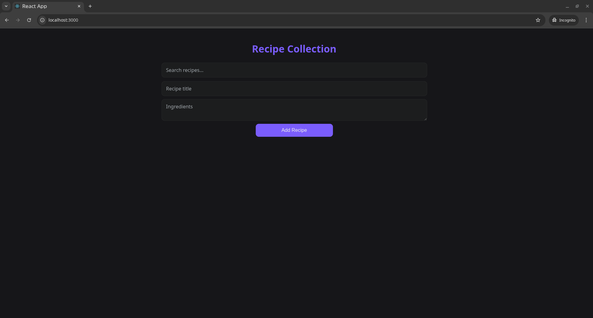

**Recipe App 🍳**
=================

A responsive, dark-themed **React application** to manage your personal recipe collection. Add, search, and view recipes, with data persisted across page reloads using _localStorage_. Fully mobile-friendly and optimized for modern devices.

**Features**
------------

*   Add new recipes with **title** and **ingredients**.
    
*   Search recipes in **real-time**.
    
*   Responsive **grid layout** that works on mobile, tablet, and desktop.
    
*   **Dark theme** with smooth hover effects.
    
*   Input and button sizes are stable — _no layout jumps_.
    
*   Recipes persist across page reloads using **localStorage**.
    
*   Test on desktop or mobile over the **same network**.
    

**Screenshots**
---------------



**Technologies Used**
---------------------

*   **React** with functional components and hooks (useState, useEffect)
    
*   **CSS** (dark theme, responsive grid, styled inputs/buttons)
    
*   **LocalStorage** for data persistence
    
*   Optional: served with npm start or production build
    

**Installation**
----------------

1.  git clone https://github.com/JANS66/recipe-app.git
    
2.  npm install
    
3.  npm start
    

The app will run at:

*   **Local:** _http://localhost:3000_

**Usage**
---------

*   **Add Recipe:** Enter a title and ingredients, then click **Add Recipe**.
    
*   **Search:** Use the search bar to filter recipes by title.
    
*   **View Recipes:** Recipes appear in a responsive grid with styled cards.
    
*   **Persistence:** All recipes are automatically saved in your browser's **localStorage**.

**Project Structure**
---------------------

```
recipe-app/  
│  
├── src/  
│   ├── components/  
│   │   ├── RecipeForm.jsx  
│   │   ├── RecipeList.jsx  
│   │   ├── RecipeCard.jsx  
│   │   └── SearchBar.jsx  
│   ├── App.jsx             
│   └── App.css
└── README.md
```

**License**
-----------

_MIT License © 2025 Albert Yanovich_